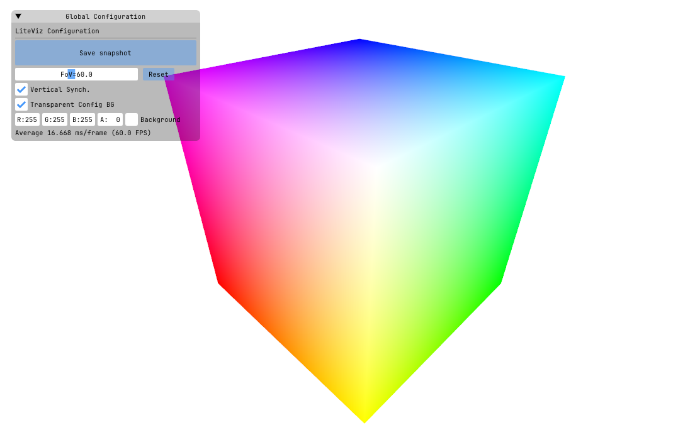

# liteviz: A Lightweight Visualizer for Real-Time 3D Application
 
**liteviz** is a lightweight 3D real-time visualization application designed for common 3D vision-related tasks, such as SLAM and 3D real-time reconstruction. It supports visualization of common 3D elements and is both lightweight and extensible, allowing integration into your application with just a few files. Custom shader support provides greater extensibility compared to [Pangolin](https://github.com/stevenlovegrove/Pangolin) and [Open3D](https://github.com/isl-org/Open3D). Compatible with C++ projects and easily wrapped for Python applications.

<p align="center">
  
</p>

## Build Instructions

### Prerequisites
C++17 or later

CMake 3.14+

### Build & Running

```bash
# build the examples/cube
git clone https://github.com/panxkun/liteviz.git
cd liteviz
mkdir build && cd build
cmake .. -DCMAKE_BUILD_TYPE=Release -DBUILD_EXAMPLES=ON && make

./examples/cube/cube-test
```

Then you will see a cube with mouse interaction.

<p align="center">
  
</p>

## How to Use in Your Project

Follow the use in `examples/cube/main.cpp` for a quick start. You only need to include the `liteviz` folder in your project. Then
```cpp
#include <liteviz/core/detail.h>

using namespace liteviz;


class YourConfig : public LiteVizConfig {
    // Your code here
};

class YourRenderer : public LiteVizRenderer {
    // Your code here
};

class YourVizApp : public LiteVizApp {
    // Your code here

    // register your renderers here
    bool initResources() override {

        std::shared_ptr<YourConfig> config = std::make_shared<YourConfig>();
        std::shared_ptr<YourRenderer> renderer = std::make_shared<YourRenderer>(config.get());
        this->_registeredRenderers.push_back(renderer);

        return true;
    }
};

```

Then your can use `YourVizApp` to start your visualization application.


### Related Projects
You can find more usage examples in the following projects:
* [openxrlab/xrslam](https://github.com/openxrlab/xrslam)
