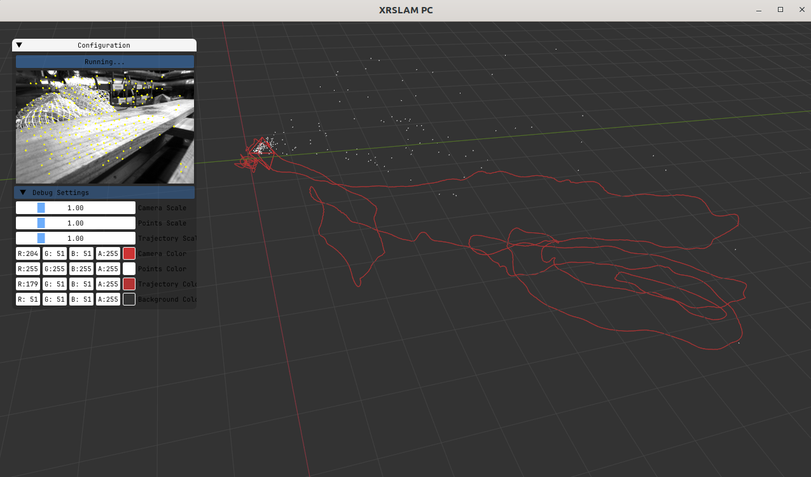
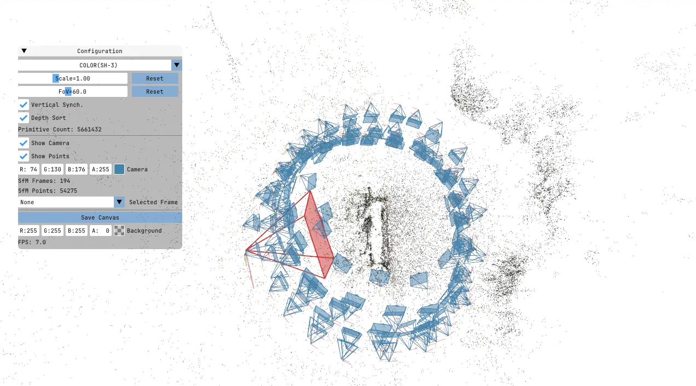
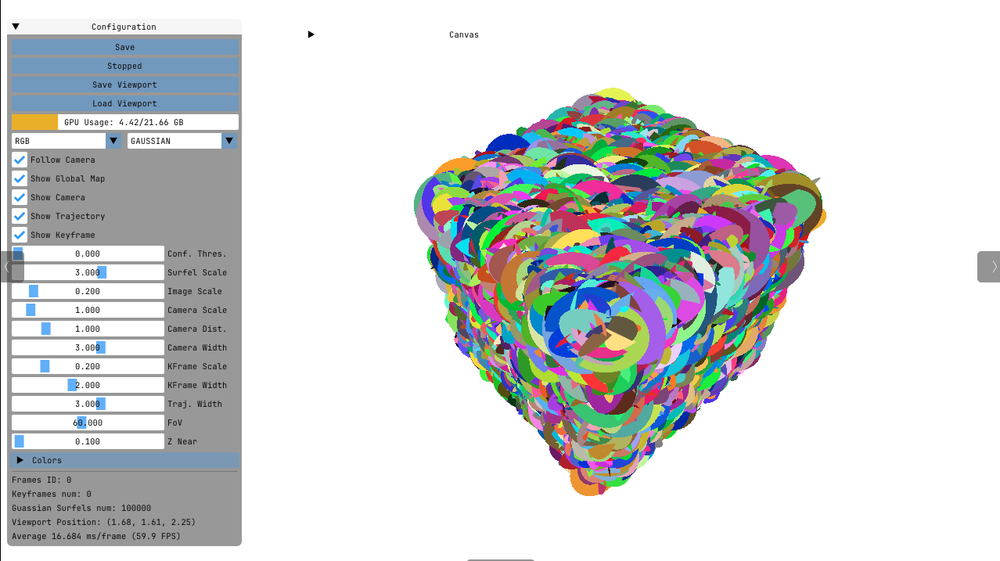

# liteviz: A Lightweight Visualizer for Real-Time 3D Application
 
**liteviz** is a lightweight 3D real-time visualization application designed for common 3D vision-related tasks, such as SLAM and 3D real-time reconstruction. It supports visualization of common 3D elements and is both lightweight and extensible, allowing integration into your application with just a few files. Custom shader support provides greater extensibility compared to [Pangolin](https://github.com/stevenlovegrove/Pangolin) and [Open3D](https://github.com/isl-org/Open3D). Compatible with C++ projects and easily wrapped for Python applications.

### Screenshots

**Real-time SLAM System**
<div style="text-align: center;">

</div>

**Structure from Motion**
<div style="text-align: center;">

</div>

**CUDA-based Surfel Rendering**
<div style="text-align: center;">

</div>


### Installation

```bash
git clone https://github.com/liteviz-dev/liteviz.git
cd liteviz && mkdir build && cd build
cmake .. && make

./app/viewer
```

### Related Projects
* [openxrlab/xrslam](https://github.com/openxrlab/xrslam)