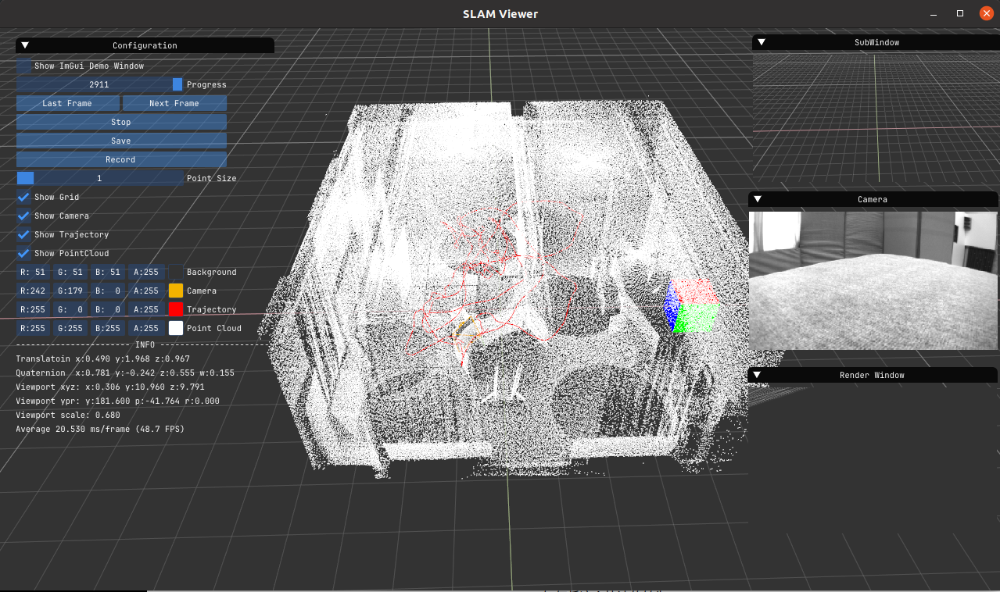
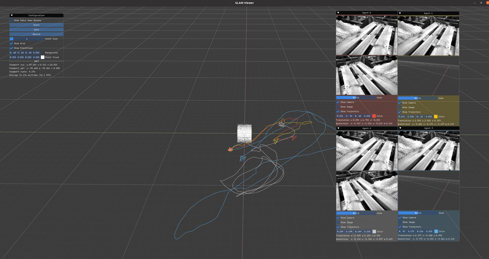

# liteviz: A Lightweight Visualizer for Real-Time 3D Application

This is a lightweight 3D real-time visualization application designed for common 3D vision-related tasks, such as SLAM and 3D real-time reconstruction. It also supports the visualization of common 3D elements. The main features of this repository are its lightweight and extensible nature, allowing you to integrate it into your application with just a few files. Additionally, it supports custom shaders, offering greater extensibility compared to [Pangolin](https://github.com/stevenlovegrove/Pangolin) and [Open3D](https://github.com/isl-org/Open3D). It is compatible with both C++ projects and can be wrapped into Python interfaces for Python applications.

### Screenshots

### Related Projects
- [xrslam](https://github.com/openxrlab/xrslam) OpenXRLab Visual-inertial SLAM Toolbox and Benchmark. It is a part of the OpenXRLab project.

